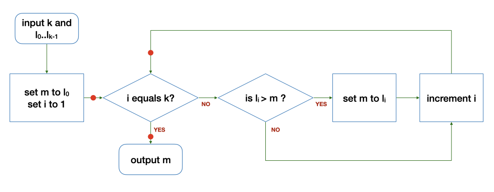
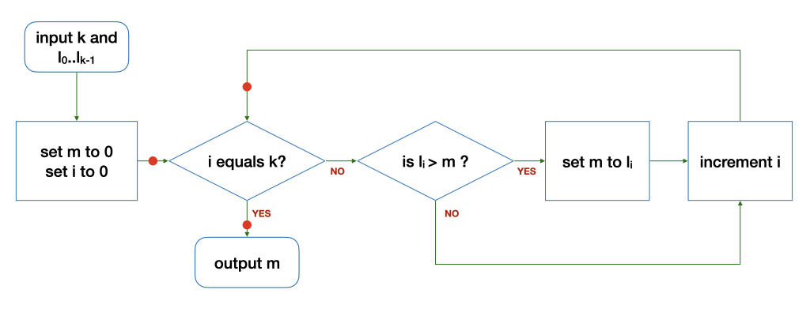

# Unit 12: Loop Invariant

## Learning Objectives

After this unit, students should:

- understand how assertions can be derived in a loop;
- understand how assertions can help us understand the behavior of a loop
- understand what is a loop invariant;
- be able to argue why a given loop invariant is true;
- be able to derive simple loop invariant of a given loop.

## Using Assertions
We have seen how we can use assertions to reason about the state of our program at different points of execution for conditional `if`-`else` statements.  We can apply the same techniques to loops.  Take the simple program below:

```C
long count(long n) {
  long y = 0;
  long x = n;
  while (x > 0) {
    // line A
    x -= 1;
    // line B
    if (x % 5 == 0) {
      // line C
      y += 1;
    }
  }
  // line D
  return y;
}
```

Before we continue, study this program and try to analyze what the function is counting and returning.

To do this more systematically, we can use assertions.  Let's ask ourselves: what can be said about the variables `x` and `y` at Lines A, B, C?  Let start with `x` first.

- Line A is the first line after entering the loop, so we can reason that to enter the loop (the first time or subsequent times), `x > 0`.
- We can also derive that, at Line A, `x <= n`.  This is less obvious: since we initialize the `x` to `n`, and after Line A, we only decrease `x`, `x` can never be more than `n`.
- At Line B, we decrease `x` by 1, so now `x >= 0 && x < n` must be true.
- At Line C, `x % 5 == 0` (i.e., x is multiple of 5) must _also_ be true (since it is in the true block of the `if` block).
- At Line D, we already exit from the loop, and the only way to exit here is that `x > 0` is false.  So we know that `x <= 0`.

Let's annotate the code with the assertions:
```C
long count(long n) {
  long y = 0;
  long x = n;
  while (x > 0) {
    // { (x > 0) && (x <= n) }
    x -= 1;
    // { (x >= 0) && (x < n) }
    if (x % 5 == 0) {
      // { (x >= 0) && (x < n) && x is multiple of 5 }
      y += 1;
    }
  }
  // { x <= 0 }
  return y;
}
```

What can be said about `y`?  It should be clear now that we increment `y` for every value between 0 and `n-1` (inclusive) that is a multiple of 5, based on the condition on Line C.  That is, it is counting the number of multiple of 5s between 0 and n-1.

## Loop Invariant

In the last unit, we say that there are five questions that we have to think about when designing loops.  The fifth question is: what is the _loop invariant_?  A loop invariant is an assertion that is true before the loop, after each iteration of the loop, and after the loop.  Thinking about the loop invariant is helpful to convince ourselves that a loop is correct, or to identify bugs in a loop.

Let's see an example of a loop invariant.  Consider the example of calculating a factorial using a loop as before.  To make the invariant simpler, let's tweak the loop slightly and start looping from `i` equals 1 up to `n`.

```C
long factorial(long n)
{
  if (n == 0) {
      return 1;
  }
  long product = 1;
  long i = 1;
  // Line A: before the loop
  while (i < n) {
    // Line B: beginning of each iteration
    i += 1;
    // Line C
    product *= i;
    // Line D: after each iteration
  }
  // Line E: after the loop
  return product;
}
```

Line A is where we want to identify the assertion before the loop; Line D is where we want to identify the assertion after each iteration of the loop.  Line E is where we want to identify the assertion after the loop.  We added Lines B and C to help us reason about the assertions at Line D.

For this function, the assertion at line A, D, and E are the same, they are all `{ product == i! }`!  Thus, we say that this loop has the invariant `{ product == i! }`.

```C
long factorial(long n)
{
  if (n == 0) {
      return 1;
  }
  long product = 1;
  long i = 1;
  // A: { product == i! }
  while (i < n) {
    // B: { product == i! }
    i += 1;
	// C: { product == (i-1)! }
    product *= i;
    // D: { product == i! }
  }
  // E: { product == i! }
  return product;
}
```

Let's see why the assertions labeled above hold.

On Line A, the assertion is obvious.  Since `product` is 1, `i` is 1, and 1! is 1.  The assertion `{ product == i! }` holds.

Let's look at Line B.  We need to argue that this assertion holds for every iteration.  This is a bit more tricky.  Let's first consider the first iteration and come back to the subsequent iterations later.  In the first iteration, the values of `product` and `i` do not change from Line A to Line B, so the assertion still holds.

On Line 11, we increment `i`.  So, at Line C of the first iteration, we have `{ product == (i-1)! }`.

On Line 13, we update `product` by multiplying it with `i`.  So, we have on Line D of the first iteration that `{ product == i! }` again.

Now, let's look at the second iteration.  There is no change to the variables `product` and `i`, between Line D of the first iteration and Line B of the second iteration.  So the assertion `{ product == i! }` still holds.  From this point onwards, we can apply the same argument over and over again, and see that the assertions on Lines B, C, and D hold for every iteration!

!!! tips "Link to CS1231"
    A more succinct and formal way to prove the above is to use a technique call _induction_ taught in CS1231.  We will not require the use of induction in CS1010, however.

After we exit the loop, we can also assert that `i == n`, and so combining `product == i! && i == n` we have `product == n!`, which is what we want.  The loop therefore correctly computes `n!`.

## Problem Set 12

### Problem 12.1

(a) Consider the algorithm to find the maximum among a list of integers $L$ with at least one element ($k > 0$) below:



The loop invariant for this loop must hold at the three points marked with the red dots: before the loop, after each iteration of the loop, and after the loop.

State the loop invariant, explain why it holds at the three points above, and threfore argue that the loop above correctly finds the maximum among the elements of the list $L$.  

(b) Now, consider a slightly different algorithm to find the maximum among a list of integers $L$ with at least one element ($k > 0$) below:



Explain why you cannot find a loop invariant similar to Part (a) above, and therefore show that the algorithm does not correctly find the maximum in certain cases.
